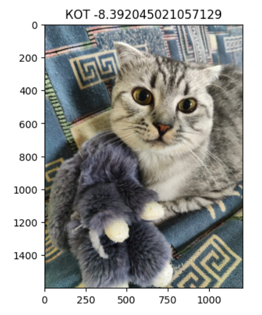
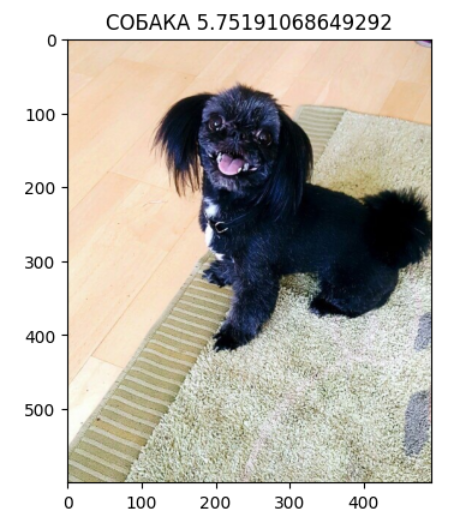

# МЕТОДИЧЕСКИЕ УКАЗАНИЯ ПО ВЫПОЛНЕНИЮ ЛАБОРАТОРНОЙ РАБОТЫ

**Дисциплина:** Методы компьютерного зрения

**Тема:** Разработка прототипа интеллектуальной системы на основе MobileNetV2 для классификации изображений.

**Курс:** 3 курс, 6 семестр

**Трудоемкость:** 4 акад. часа

**Цели:**

- изучение методов построения и обучения сверточных нейронных сетей для классификации изображений;
- освоить выбор и использование инструментов разработки на Python, приемлемых для создания прикладной системы обработки научных данных, машинного обучения и визуализации с заданными требованиями (PL-1.2, средний);
- освоение (проводя выбор и эксперименты) известных алгоритмов и библиотек компьютерного зрения, предобученных глубоких нейросетевых моделей для прикладных задач анализа изображений и видеопотока, при необходимости дообучая и валидируя на собственных наборах данных (DL-3.1, средний).

**Задача:** разработать прототип интеллектуальной системы с применением сверточных нейронных сетей для классификации изображений.

## 1. Порядок выполнения

- Выбрать набор данных, содержащий изображения, относящиеся минимум к 2 классам.
- Разбить датасет на обучающую и тестовую выборки в соотношении 80/20.
- Выполнить предобработку изображений: масштабирование, нормализация и др.
- Создать архитектуру сверточной нейронной сети. Для чего следует:
  - а) использовать базовую модель MobileNetV2 (или аналогичные модели) как сверточную основу;
  - б) добавить слои глобального усреднения, дропаута и полносвязный выходной слой.
- Задать параметры компиляции: оптимизатор, функцию потерь и др.
- Обучить созданную нейронную сеть на обучающей выборке.
- Оценить качество обученной модели на тестовой выборке с помощью метрик точности и полноты.
- Провести анализ ошибок классификации на тестовой выборке.
- Экспортировать обученную модель в любом удобном формате и протестировать ее на нескольких загруженных изображениях.
- Визуализировать промежуточные результаты обучения и предсказания модели.
- Сделать выводы о проделанной работе, оформить отчет.

## 2. Пример реализации лабораторной работы

Лабораторная работа решает задачи классификации изображений с применением сверточных нейронных сетей и методики transfer learning. Она ориентирована на освоение практических навыков построения и применения моделей глубокого обучения на реальных данных, с использованием библиотеки TensorFlow и предварительно обученной архитектуры MobileNetV2. В ходе выполнения студент проходит все этапы, начиная с загрузки и подготовки данных, и заканчивая тестированием модели на собственных изображениях.

С помощью `tensorflow_datasets` загружается датасет `cats_vs_dogs`, включающий изображения кошек и собак.

```python
train, info = tfds.load('cats_vs_dogs', split=['train[:100%]'], with_info=True, as_supervised=True)
```

Данные автоматически размечены и загружаются как кортежи (изображение, метка). Далее производится визуализация первых нескольких изображений и выводится базовая информация о наборе.

```python
for img, label in train[0].take(5):
    plt.figure()
    plt.imshow(img)
    print(label)
```

Затем изображения обрабатываются: каждый кадр приводится к нужному размеру (224x224 пикселя), нормализуется в диапазоне [0, 1] и преобразуется в формат, который ожидает нейронная сеть. Используется функция `resize_image`, и к данным применяется метод `map`, реализующий пакетную трансформацию. Данные перемешиваются и группируются в батчи по 16 изображений с помощью `.shuffle()` и `.batch()`.

```python
SIZE = 224
def resize_image(img, label):
    img = tf.cast(img, tf.float32)
    img = tf.image.resize(img, (SIZE, SIZE))
    img = img / 255.0
    return img, label

train_resized = train[0].map(resize_image)
train_batches = train_resized.shuffle(1000).batch(16)
```

Далее применяется transfer learning — методика, при которой используется предварительно обученная на большом датасете модель (в данном случае MobileNetV2), а к ней добавляются новые слои, адаптированные под конкретную задачу. Модель MobileNetV2 загружается без верхних слоев (`include_top=False`), чтобы использовать её как экстрактор признаков. Её веса замораживаются (обучение не проводится), чтобы не нарушать уже сформированную структуру.

К этой базе добавляются следующие слои:

- GlobalAveragePooling2D — преобразует выход MobileNet в вектор фиксированной длины;
- Dropout (0.2) — снижает переобучение;
- Dense(1) — выходной слой с одним нейроном.

```python
model = tf.keras.Sequential([
    base_layers,
    GlobalAveragePooling2D(),
    Dropout(0.2),
    Dense(1)
])
model.compile(loss=tf.keras.losses.BinaryCrossentropy(from_logits=True))
```

Выходной слой `Dense` задаётся без функции активации, поэтому модель возвращает логит — неограниченное вещественное значение. Параметр `from_logits=True` сообщает функции потерь, что на вход передаются именно логиты. Для получения вероятности положительного класса к выходу модели необходимо применить sigmoid.

Модель компилируется с функцией потерь BinaryCrossentropy, подходящей для бинарной классификации. Затем проводится обучение модели на одной эпохе на всех подготовленных батчах. Даже одного прохода достаточно, чтобы увидеть базовую обучаемость модели за счет предварительных весов.

Пользователь может загрузить свои изображения, они автоматически обрабатываются той же функцией `resize` и подаются на вход модели. Изображения выводятся на экран с соответствующим заголовком и вероятностным предсказанием (Рис. 1).

|  |  |
|---|---|
|  |  |

*Рис. 1. Результаты работы модели*

Предсказание можно интерпретировать одним из двух эквивалентных способов:

- сравнить исходный логит с `0`: отрицательное значение соответствует классу «КОТ», неотрицательное — классу «СОБАКА»;
- применить sigmoid и сравнить полученную вероятность с `0.5`.

Чем меньше логит, тем выше уверенность модели в классе «КОТ»; чем больше логит, тем выше уверенность в классе «СОБАКА». Для отображения уверенности в диапазоне от 0 до 1 следует использовать значение `tf.sigmoid(logit)`.

## 3. Варианты наборов данных

- MNIST. Рукописные цифры от 0 до 9.
- Fashion-MNIST. Изображения предметов одежды — футболки, кроссовки, платья и др.
- CIFAR-10. Маленькие цветные изображения с 10 классами объектов: транспорт, животные и др.
- ImageNet. Крупный и разнообразный датасет с широким спектром визуальных категорий.
- Caltech-101. Изображения объектов из разных категорий: животные, инструменты, транспорт.
- SVHN. Цифры, вырезанные из уличных фотографий, похожие на номера домов.
- EMNIST. Рукописные английские символы (буквы и цифры), ориентирован на распознавание алфавита.
- KMNIST. Японские иероглифы каны, предназначенные для задач символного распознавания.
- notMNIST. Буквы латинского алфавита из разных шрифтов, используется как альтернатива MNIST.
- LFW (Labeled Faces in the Wild). Фотографии лиц с аннотациями по идентичности, для задач распознавания.
- CelebA. Лица знаменитостей с метками по визуальным атрибутам (пол, выражение, прическа и т.д.).
- Stanford Dogs. Породы собак для тонкой классификации внутри одного типа объектов.
- Oxford 102 Flowers. Разнообразные цветы, каждая категория — отдельный вид растения.
- Food-101. Изображения блюд различных кухонь мира, используется в задачах food-recognition.
- Fruits 360. Чистые изображения фруктов и овощей, полезны для проектов в агросекторе.
- Intel Image Classification. Сцены природы и городской среды: горы, леса, дороги и здания.
- GTSRB (German Traffic Signs). Дорожные знаки для задач транспортной безопасности.
- PlantVillage. Листья культурных растений, классифицированные по признакам болезней.
- ChestX-ray8. Медицинские рентгеновские снимки с аннотациями по заболеваниям.
- Cassava Leaf Disease. Листья маниоки, размеченные по типу патологии или здорового состояния.
- Pistachio Dataset. Классификация фисташек по внешним признакам качества.
- Rice Image Dataset. Разные сорта риса, полезны для распознавания сельхозпродукции.
- CUB-200-2011. Птицы, размеченные по видам и атрибутам, для детализированной классификации.
- Stanford Cars. Изображения автомобилей, классифицированных по марке и модели.
- DeepWeeds. Фотографии сорных растений, собранные в австралийской сельской местности, для агроанализа.

## 4. ОТЧЕТ И КРИТЕРИИ ОЦЕНКИ

### 4.1. Структура отчета

Отчет должен содержать:

- Описание выбранного датасета.
- Архитектуру итоговой модели.
- Графики обучения (accuracy/loss).
- Матрицу ошибок и её анализ.
- Примеры ошибочных классификаций с комментариями.
- Примеры успешной классификации пользовательских изображений.
- Выводы о достигнутом качестве, причинах ошибок, эффективности Transfer Learning.
- Сохраненный файл модели.

### 4.2. Критерии оценки

| Критерий | Баллы |
|---|---:|
| Подготовка данных и корректное разбиение выборки | 15 |
| Работоспособный прототип на основе MobileNetV2 | 35 |
| Обучение, метрики и анализ ошибок | 25 |
| Воспроизводимость, визуализации и отчёт | 15 |
| Защита и ответы на контрольные вопросы | 10 |

Шкала: 90–100 — «отлично», 70–89 — «хорошо», 50–69 — «удовлетворительно», 0–49 — «неудовлетворительно». Grad-CAM или веб-интерфейс могут быть выполнены дополнительно, но не являются обязательным условием конкретной оценки.

## 5. Контрольные вопросы

- Что такое нейрон и как он моделируется математически в искусственных нейросетях?
- Что представляет собой задача классификации изображений?
- Что такое transfer learning?
- Почему важно замораживать веса предобученной модели при её дообучении?
- Что делает слой GlobalAveragePooling2D и зачем он используется?
- Как работает слой Dropout и зачем он нужен в архитектуре сети?
- Чем отличаются функции активации ReLU, sigmoid и tanh?
- Что такое градиентный спуск?
- Что такое переобучение в нейросетях и как с ним бороться?
- Что такое рекуррентные нейронные сети и чем они отличаются от обычных?
- В чём принципиальное отличие сверточных нейронных сетей (CNN) от полносвязных?
- Что делает сверточный слой и какую задачу он решает?
- Какую роль выполняет слой подвыборки (pooling), например MaxPooling?
- Что такое эпоха (epoch) и шаг (step) в процессе обучения нейросети?
- Зачем нужна функция потерь и как она влияет на обучение модели?

## 6. РЕКОМЕНДУЕМАЯ ЛИТЕРАТУРА

- PyTorch Documentation: [https://pytorch.org/docs/stable/index.html](https://pytorch.org/docs/stable/index.html)
- Torchvision Models: [https://pytorch.org/vision/stable/models.html](https://pytorch.org/vision/stable/models.html)
- He, K., Zhang, X., Ren, S., & Sun, J. (2016). Deep residual learning for image recognition. In Proceedings of the IEEE conference on computer vision and pattern recognition (pp. 770-778).
- ImageNet Class Labels: [https://gist.github.com/yrevar/942d3a0ac09ec9e5eb3a](https://gist.github.com/yrevar/942d3a0ac09ec9e5eb3a)
- Grad-CAM Paper: Selvaraju, R. R., et al. (2017). Grad-cam: Visual explanations from deep networks via gradient-based localization. In Proceedings of the IEEE international conference on computer vision (pp. 618-626). [https://github.com/ramprs/grad-cam](https://github.com/ramprs/grad-cam)
- Sandler, M., Howard, A., Zhu, M., Zhmoginov, A., & Chen, L. C. (2018). MobileNetV2: Inverted Residuals and Linear Bottlenecks. In Proceedings of the IEEE conference on computer vision and pattern recognition (CVPR), pp. 4510-4520.  
  [https://openaccess.thecvf.com/content_cvpr_2018/papers/Sandler_MobileNetV2_Inverted_Residuals_CVPR_2018_paper.pdf](https://openaccess.thecvf.com/content_cvpr_2018/papers/Sandler_MobileNetV2_Inverted_Residuals_CVPR_2018_paper.pdf)
- Шолле, Ф. (2022). Глубокое обучение на Python. (Разделы про перенос обучения / Transfer Learning). [https://github.com/fchollet/deep-learning-with-python-notebooks](https://github.com/fchollet/deep-learning-with-python-notebooks)
- Transfer learning & fine-tuning. [https://keras.io/guides/transfer_learning/](https://keras.io/guides/transfer_learning/)
- Стивенс, Э., Антига, Л. (2022). Глубокое обучение на PyTorch.
