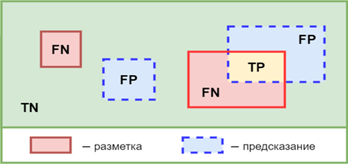

<!-- Источник: Методические указания к лабораторной работе 5 с компетенциями.docx -->

# МЕТОДИЧЕСКИЕ УКАЗАНИЯ ПО ВЫПОЛНЕНИЮ ЛАБОРАТОРНОЙ РАБОТЫ №5

**Дисциплина:** Методы компьютерного зрения

**Тема:** Изучение методов оценки качества моделей компьютерного зрения

**Курс:** 3 курс, 6 семестр

**Трудоемкость:** 4 акад. часа

## 1. ВВЕДЕНИЕ

**Цели работы:**

- освоение методов количественной оценки качества моделей компьютерного зрения.
- освоение методов расчёта ключевых метрик оценки качества для задач классификации и детекции объектов и их интерпретация;
- изучение способов анализа результатов работы модели с использованием матрицы ошибок, ROC-кривой и метрики mAP;
- освоить выбор и использование инструментов разработки на Python, приемлемых для создания прикладной системы обработки научных данных, машинного обучения и визуализации с заданными требованиями (PL-1.2, средний);
- научиться валидировать и сравнивать известные модели компьютерного зрения на собственных данных (`DL-3.1`, средний).

**Задачи работы:**

- Изучить теоретические основы метрик оценки качества моделей компьютерного зрения.
- Освоить построение и интерпретацию матрицы ошибок (Confusion Matrix) для задачи классификации.
- Научиться рассчитывать метрики Precision, Recall, F1-score, Accuracy.
- Освоить построение ROC-кривой и вычисление AUC (Area Under Curve).
- Изучить метрику mAP (mean Average Precision) для оценки качества детекции объектов.
- Провести сравнительный анализ производительности различных архитектур моделей.
- Сформировать навыки интерпретации результатов оценки и формулирования выводов о качестве модели.

**Необходимое ПО:**

- Python 3.8+
- Jupyter Notebook / Google Colab
- Библиотеки: `scikit-learn`, `numpy`, `matplotlib`, `seaborn`, `pandas`, `ultralytics` (для работы с YOLO), `opencv-python`

## 2. ТЕОРЕТИЧЕСКАЯ ЧАСТЬ

### 2.1. Оценка качества моделей машинного обучения

Оценка качества модели — это процесс количественного измерения того, насколько хорошо обученная модель решает поставленную задачу. В компьютерном зрении оценка качества критически важна для выбора оптимальной архитектуры, настройки гиперпараметров и сравнения различных подходов.

### 2.2. Метрики для задач классификации

Матрица ошибок (Confusion Matrix) — это таблица, позволяющая визуализировать производительность алгоритма классификации. Для бинарной классификации матрица имеет размер 2×2:

|  | Предсказано: Положительный | Предсказано: Отрицательный |
|---|---|---|
| Реально: Положительный | TP (True Positive) | FN (False Negative) |
| Реально: Отрицательный | FP (False Positive) | TN (True Negative) |

Основные метрики, рассчитываемые на основе матрицы ошибок:

- Accuracy (точность) — доля правильных ответов: `(TP + TN) / (TP + TN + FP + FN)`
- Precision (точность предсказаний) — доля объектов, действительно принадлежащих классу, среди всех объектов, отнесённых моделью к этому классу: `TP / (TP + FP)`
- Recall (полнота) — доля объектов класса, правильно обнаруженных моделью: `TP / (TP + FN)`
- F1-score — среднее гармоническое Precision и Recall: `2 * (Precision * Recall) / (Precision + Recall)`.



*Рис. 1. Пояснение к вычислению элементов матрицы:  TP, TN, FP, FN*

### 2.3. ROC-кривая и AUC

ROC-кривая (Receiver Operating Characteristic) визуализирует зависимость доли истинно положительных результатов (TPR) от доли ложноположительных результатов (FPR) при варьировании порога классификации.

AUC (Area Under Curve) — площадь под ROC-кривой. Значение AUC показывает способность модели различать классы:

- AUC = 1.0 — идеальный классификатор
- AUC > 0.9 — отличный классификатор
- AUC = 0.5 — модель работает на уровне случайного угадывания.

### 2.4. Метрики для задач детекции объектов

Intersection over Union (IoU) — метрика, измеряющая степень перекрытия предсказанного и реального bounding box'а. Вычисляется как отношение площади пересечения к площади объединения.

Average Precision (AP) — средняя точность для одного класса. Рассчитывается как площадь под кривой Precision-Recall.

mAP (mean Average Precision) — среднее значение AP по всем классам. Является основной метрикой для оценки моделей детекции объектов:

- mAP@0.5 — AP при IoU-пороге 0.5,
- mAP@0.5:0.95 — среднее значение AP при IoU-порогах от 0.5 до 0.95 с шагом 0.05.

## 3. ПОРЯДОК ВЫПОЛНЕНИЯ РАБОТЫ

Работа выполняется в Jupyter Notebook. Для каждого задания создавайте отдельную ячейку с кодом и комментариями.

### 3.1. Подготовка рабочего окружения

Установите необходимые библиотеки:

```bash
pip install scikit-learn numpy matplotlib seaborn pandas ultralytics opencv-python
```

#Импортируйте их в начале ноутбука:

```python
import numpy as np
import matplotlib.pyplot as plt
import seaborn as sns
import pandas as pd
from sklearn.datasets import make_classification
from sklearn.model_selection import train_test_split
from sklearn.ensemble import RandomForestClassifier
from sklearn.metrics import (
    confusion_matrix, ConfusionMatrixDisplay,
    accuracy_score, precision_score, recall_score, f1_score,
    roc_curve, roc_auc_score, RocCurveDisplay,
    classification_report
)
from sklearn.preprocessing import label_binarize
from ultralytics import YOLO
import cv2

%matplotlib inline
plt.rcParams['figure.figsize'] = (12, 8)
```

### 3.2. Оценка качества классификатора (задача классификации)

- Сгенерируйте синтетический набор данных для задачи классификации:

```python
X, y = make_classification(n_samples=1000, n_features=20, 
                           n_informative=15, n_redundant=5,
                           n_classes=3, random_state=42)
```

- Разделите данные на обучающую и тестовую выборки (70% / 30%).
- Обучите модель классификации (например, Random Forest) на обучающей выборке.
- Выполните предсказание на тестовой выборке.

#### Построение матрицы ошибок

- Постройте матрицу ошибок для полученных предсказаний с использованием `confusion_matrix` и визуализируйте её с помощью `ConfusionMatrixDisplay` или `seaborn.heatmap`.
- Проанализируйте матрицу ошибок:
  - Какие классы модель путает чаще всего?
  - Для каких классов точность предсказаний наивысшая?

#### Расчёт метрик качества

- Рассчитайте следующие метрики для каждого класса и в целом по модели:
  - Accuracy
  - Precision (micro, macro, weighted)
  - Recall (micro, macro, weighted)
  - F1-score (micro, macro, weighted)
- Выведите полный отчёт о классификации с помощью `classification_report`.
- Заполните таблицу:

| Метрика | Значение |
|---|---|
| Accuracy |  |
| Precision (macro) |  |
| Recall (macro) |  |
| F1-score (macro) |  |

#### Построение ROC-кривой и расчёт AUC

- Для многоклассовой классификации выполните бинаризацию меток с помощью `label_binarize`.
- Получите вероятности предсказаний для каждого класса с использованием `predict_proba`.
- Для каждого класса постройте ROC-кривую и рассчитайте AUC.
- Визуализируйте ROC-кривые для всех классов на одном графике.
- Проанализируйте полученные значения AUC-:
  - Какой класс модель распознаёт лучше всего?
  - Есть ли классы, для которых AUC близок к 0.5?

**Замечание:**

- Для визуализации ROC-кривых используйте `RocCurveDisplay.from_predictions()`.
- Для многоклассового случая используйте подход "один против всех" (one-vs-rest).

### 3.3. Оценка качества модели детекции (задача детекции объектов)

#### Детекция объектов с использованием YOLO

- Загрузите предобученную модель YOLO (`yolov8n.pt`).
- Загрузите тестовое изображение (можно использовать стандартное `bus.jpg` из репозитория Ultralytics или любое другое изображение с несколькими объектами).
- Выполните детекцию объектов на изображении.
- Для каждого обнаруженного объекта запишите:
  - координаты bounding box;
  - класс объекта;
  - уверенность (confidence).

#### Задание 6: Расчёт метрик для детекции

Примечание: для полноценного расчёта mAP необходим размеченный датасет с ground truth. В рамках лабораторной работы предлагается выполнить расчёт на основе синтетически созданных ground truth или использовать встроенные средства Ultralytics.

- Используйте встроенную функцию оценки модели YOLO:

```python
results = model.val(data='coco128.yaml', imgsz=640, batch=16, conf=0.25, iou=0.45)
```

(Для выполнения этого шага необходимо наличие датасета COCO128, который автоматически загружается при первом вызове.)

- Изучите отчёт о качестве модели, который содержит:
  - mAP@0.5
  - mAP@0.5:0.95
  - Precision и Recall для каждого класса
- Заполните таблицу:

| Метрика | Значение |
|---|---|
| mAP@0.5 |  |
| mAP@0.5:0.95 |  |
| Precision (среднее) |  |
| Recall (среднее) |  |

#### Сравнительный анализ архитектур (дополнительно)

- Загрузите несколько версий моделей YOLO (например, `yolov8n.pt`, `yolov8s.pt`).
- Для каждой модели выполните оценку на тестовом датасете.
- Сравните значения mAP@0.5 и mAP@0.5:0.95 для разных моделей.
- Сделайте вывод о компромиссе между размером модели и качеством детекции.

## 4. ОТЧЕТ И КРИТЕРИИ ОЦЕНКИ

### 4.1. Структура отчета

Отчет должен быть оформлен в виде Jupyter Notebook и содержать:

- Титульная страница: Название работы, дисциплина, группа, ФИО студента.
- Введение: Краткая формулировка цели и задач работы.
- Теоретическая часть: Краткое описание метрик оценки качества (Confusion Matrix, Precision, Recall, F1-score, ROC-AUC, mAP).
- Ход работы: Последовательное выполнение заданий с кодом и комментариями.
  - Генерация данных, обучение модели классификации.
  - Матрица ошибок и её анализ.
  - Расчёт метрик качества классификации.
  - ROC-кривые и AUC.
  - Детекция объектов с YOLO.
  - Расчёт метрик для детекции.
- Выводы: Детальные выводы по каждому из разделов работы. Какой класс распознаётся лучше всего? Какие метрики наиболее информативны для оценки качества модели? Какой компромисс между скоростью и точностью выявлен при сравнении архитектур?

### 4.2. Критерии оценки

Оценка за лабораторную работу выставляется по следующим критериям:

- «Отлично» (90–100 %): Все задания выполнены в полном объеме, код корректен и эффективен, в отчете представлены все необходимые визуализации, таблицы и анализ. Выводы глубокие и обоснованные. Дополнительное задание выполнено.
- «Хорошо» (70–89 %): Все основные задания выполнены. Код работает, но может содержать незначительные недочеты. Анализ результатов присутствует, но может быть неполным. Выводы сформулированы.
- «Удовлетворительно» (50–69 %): Задания выполнены частично. Код работает с ошибками или нестабильно. Анализ результатов минимален или отсутствует.
- «Неудовлетворительно» (0–49 %): Задания не выполнены или выполнены некорректно.

## 5. КОНТРОЛЬНЫЕ ВОПРОСЫ

Для подготовки к защите лабораторной работы необходимо разобраться в следующих вопросах:

- Что такое матрица ошибок (Confusion Matrix) и какие компоненты она содержит?
- В чём разница между Accuracy, Precision и Recall? Приведите примеры, когда высокая Accuracy может быть обманчивой.
- Что такое F1-score и почему он используется вместо простого среднего арифметического Precision и Recall?
- Что такое ROC-кривая и как она строится? Что означает значение AUC = 0.5? AUC = 1.0?-
- В чём отличие ROC-кривой от PR-кривой? В каких случаях предпочтительнее использовать PR-кривую?
- Что такое IoU (Intersection over Union) и как он используется в задачах детекции?
- Что такое Average Precision (AP) и mAP (mean Average Precision)?-
- В чём отличие mAP@0.5 от mAP@0.5:0.95?-
- Какие метрики наиболее информативны для оценки качества модели в задачах с несбалансированными классами?
- Как интерпретировать матрицу ошибок для многоклассовой классификации? Что можно узнать о модели, анализируя её?

## 6. РЕКОМЕНДУЕМАЯ ЛИТЕРАТУРА

- Scikit-learn Documentation: Metrics and scoring:  
  [https://scikit-learn.org/stable/modules/model_evaluation.html](https://scikit-learn.org/stable/modules/model_evaluation.html)
- Ultralytics YOLO Documentation: Model Evaluation  
  [https://docs.ultralytics.com/modes/val/](https://docs.ultralytics.com/modes/val/)
- OpenCV: Evaluation Metrics for Object Detection — [https://opencv.org/-](https://opencv.org/)
- Гудфеллоу Я., Бенджио И., Курвилль А. Глубокое обучение. — М.: ДМК Пресс, 2018. — Глава 5 (Оценка моделей).
- Understanding Model Evaluation Metrics for Image Classification — [https://akridata.ai/](https://akridata.ai/)
- Kukil (2022). Mean Average Precision (mAP) in Object Detection. [https://learnopencv.com/mean-average-precision-map-object-detection-model-evaluation-metric/](https://learnopencv.com/mean-average-precision-map-object-detection-model-evaluation-metric/)
- Object-Detection-Metrics. [https://github.com/rafaelpadilla/object-detection-metrics](https://github.com/rafaelpadilla/object-detection-metrics)
- Object Detection Metrics. [https://github.com/rafaelpadilla/review_object_detection_metrics](https://github.com/rafaelpadilla/review_object_detection_metrics)
- R. Padilla, S. L. Netto and E. A. B. da Silva, "A Survey on Performance Metrics for Object-Detection Algorithms," 2020 International Conference on Systems, Signals and Image Processing (IWSSIP), Niteroi, Brazil, 2020, pp. 237-242, doi: 10.1109/IWSSIP48289.2020.9145130.
- Redmon, J., & Farhadi, A. (2018). YOLOv3: An Incremental Improvement. [https://arxiv.org/abs/1801.04381](https://arxiv.org/abs/1801.04381)
- Wang, A., et al. (2024). YOLOv10: Real-Time End-to-End Object Detection. [https://arxiv.org/abs/2405.14458](https://arxiv.org/abs/2405.14458)
